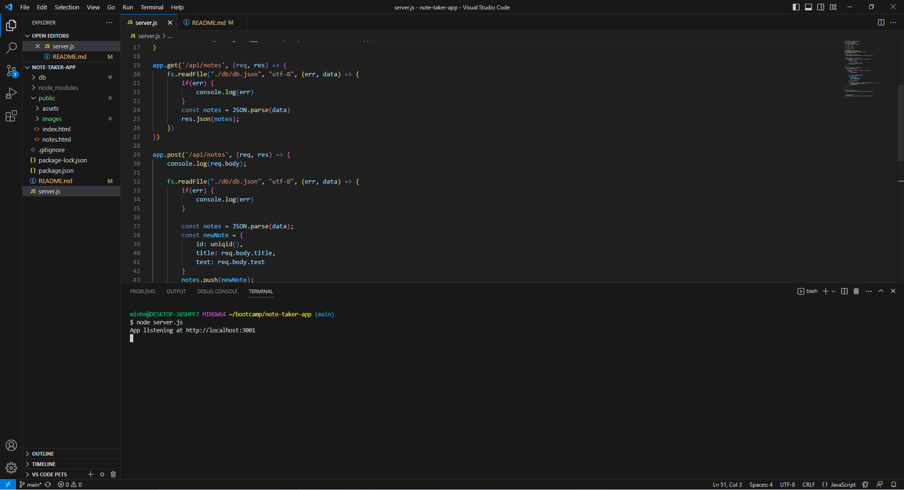
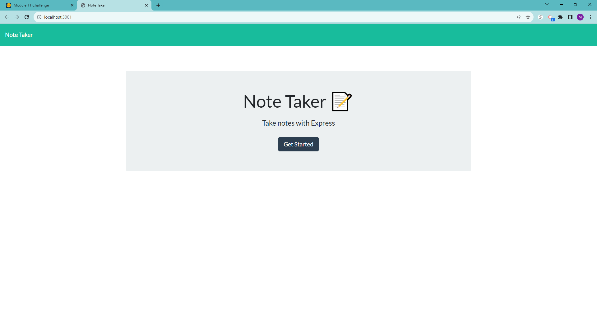
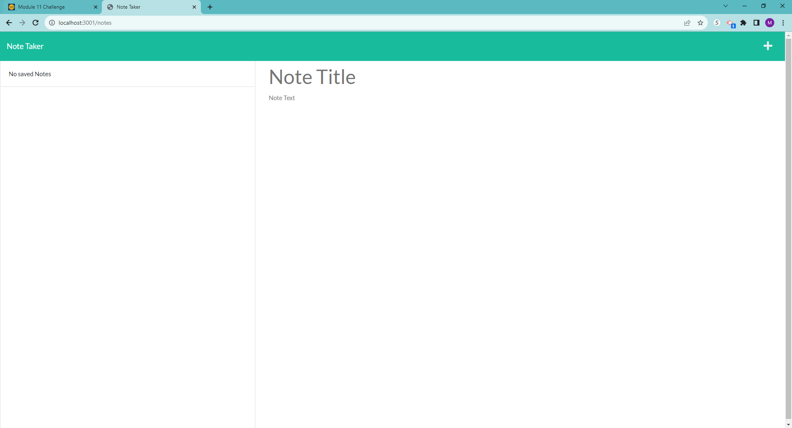
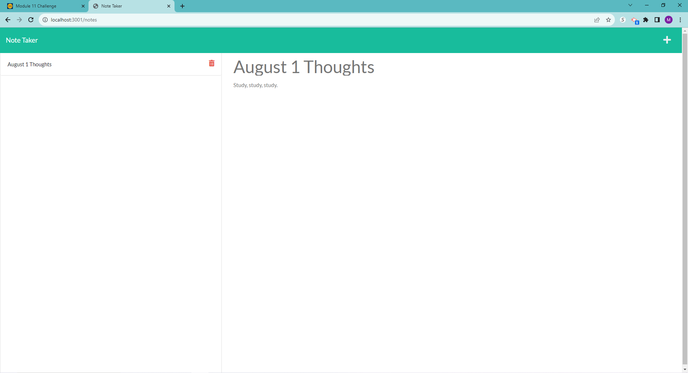
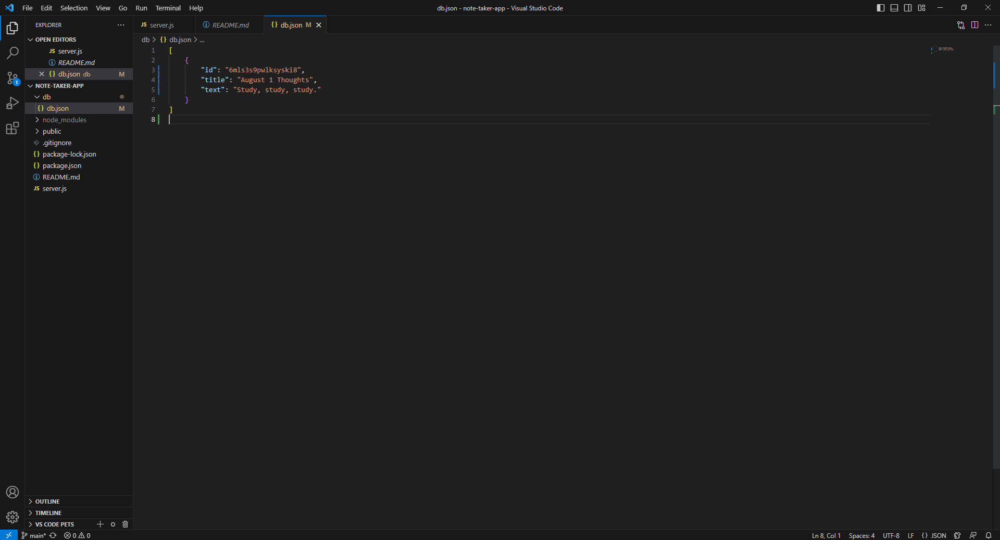

# note-taker-app

## Description

This application was created so that users can have a place to write down their thoughts, memos, or to-dos that will be saved with the click of a button. It utilizes skills from Express js with the use of GET and POST routes. 

## Table of Contents

If your README is long, add a table of contents to make it easy for users to find what they need.

- [Installation](#installation)
- [Usage](#usage)
- [Credits](#credits)

## Installation

2 Outside applications are needed to run this program from the server-side:
1. node.js (https://nodejs.org/en)
2. npm install express

## Usage

Type in "node server.js" in the integrated terminal to run the application. Then, click the link provided to open in your browser through the server.

This is the starting page you're taken to through the terminal. 

Shown here, there are no current notes saved.

You can simply type in a title and a note and click the save button in the top right corner. (not shown currently because it was already clicked)

The data typed by the user will then be stored in the db.json with a unique id, generated by the uniqid npm.

## Credits

Tutor Joem Casusi